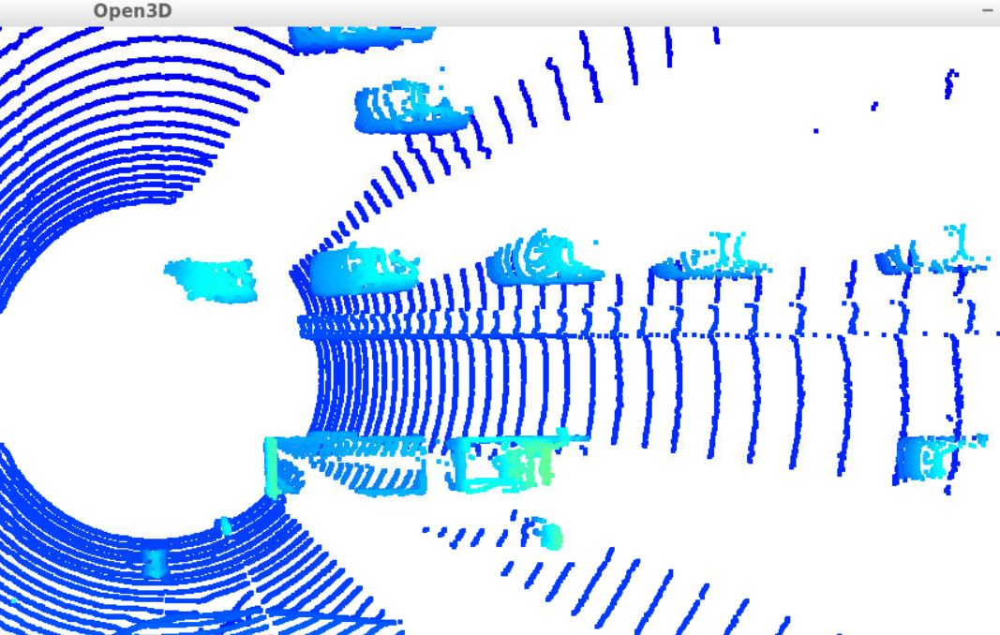
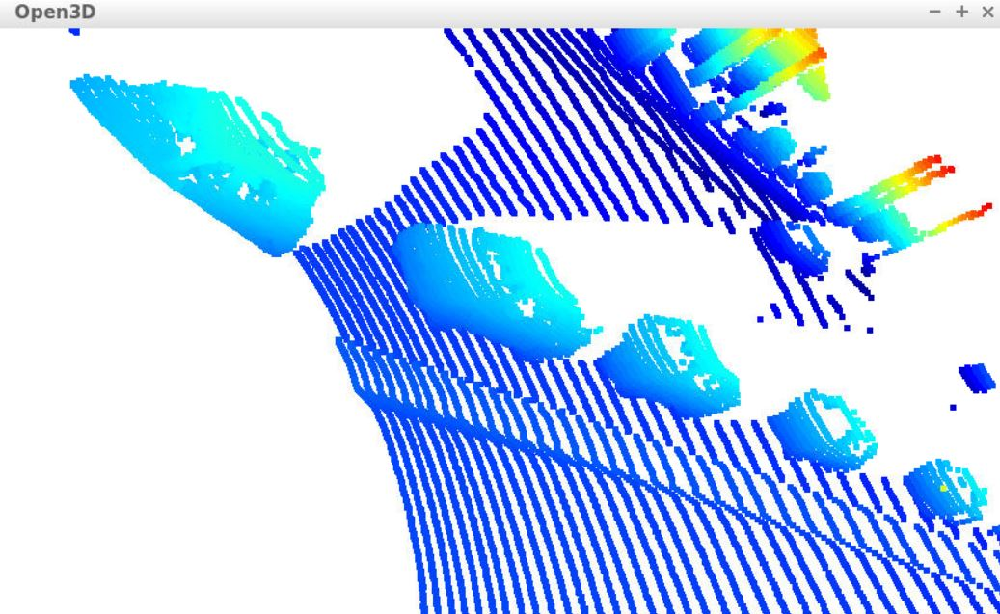
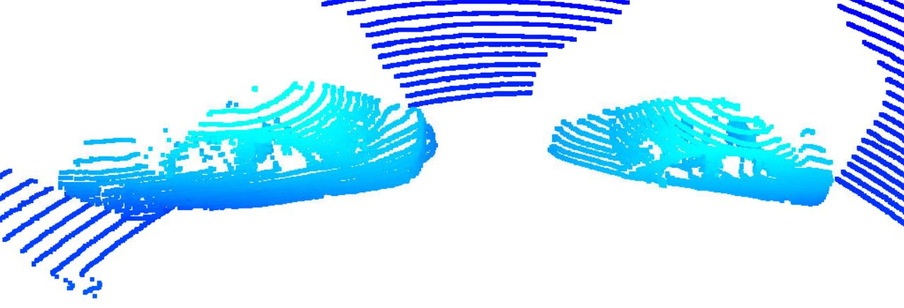
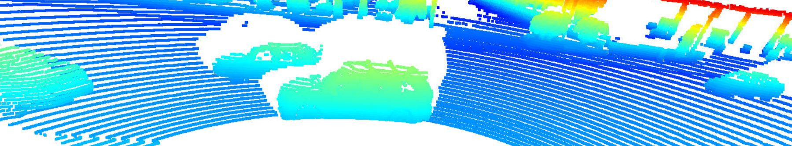

# Track 3D-Objects Over Time

### 1.  Four tracking steps - (filter, track management, association, camera fusion)

In the Waymo Open dataset, lidar data is stored as a range image. 
Therefore, this task is about extracting two of the data channels within the range image, which are "range" and "intensity", 
and convert the floating-point data to an 8-bit integer value range. 
Finally we stack the range and intensity image vertically and visualize it.

Further we use the Open3D library to display the lidar point-cloud in a 3d viewer in order to
 develop a feel for the nature of lidar point-clouds

Some of the clearly visible features include the chassis of the car, front bumper. In some cases the additional features include the car windows, car lights, roof carriers, headlights, tail lights, car tyres etc. Some of the images showing cars that are far off show poor visibility of smaller sized features like tyres or side windows though chassis is still visible to some extent.

### 2. Do you see any benefits in camera-lidar fusion compared to lidar-only tracking (in theory and in your concrete results)? 
Camera lidar fusion definitely adds more clarity and information to lidar only tracking.

### 3. Which challenges will a sensor fusion system face in real-life scenarios? Did you see any of these challenges in the project?

Sensor fusion systems definitely face a real life challenge of merging data of different types from different sensors.
Also, understanding of each sensor working needs to be developed in order to overcome the merging issues.
This was a unique project for me and I am working on such sensor fusion code for the first time.

### 4. Can you think of ways to improve your tracking results in the future?

Tracking results can definitely be improved by high end lidar sensors and using optimal models.
